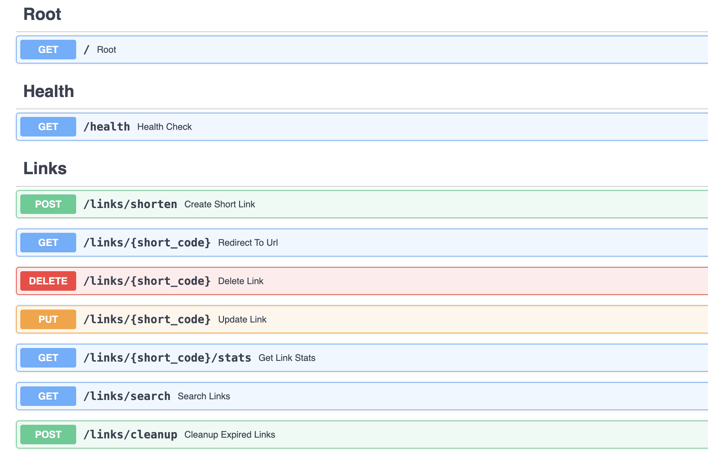

# ShortLink API

Сервис для создания коротких ссылок с поддержкой аналитики, кастомных алиасов и временных ссылок.

## Функциональность

- **Создание коротких ссылок** - автоматическая генерация или пользовательские алиасы
- **Управление ссылками** - CRUD операции для коротких ссылок
- **Статистика** - отслеживание переходов, даты создания и последнего использования
- **Временные ссылки** - автоматическое удаление по истечении срока действия
- **Поиск** - поиск ссылок по оригинальному URL
- **Кэширование** - Redis для быстрого доступа к популярным ссылкам

## Технологический стек

| Компонент | Технологии |
|-----------|------------|
| Backend | FastAPI, Python 3.12 |
| База данных | PostgreSQL + asyncpg, SQLAlchemy 2.0 |
| Кэширование | Redis |
| Контейнеризация | Docker, Docker Compose |
| Документация | Swagger UI, ReDoc |

## Структура проекта
```bash
├── api/
│ ├── init.py
│ ├── database.py       # Подключение к PostgreSQL
│ ├── models.py         # SQLAlchemy модели
│ ├── schemas.py        # Pydantic схемы
│ ├── redis.py          # Redis клиент
│ └── routers/
│   ├── init.py
│   └── links.py        # Эндпоинты для ссылок
│
├── main.py             # Точка входа
├── Dockerfile          # Сборка образа
├── docker-compose.yml  # Оркестрация контейнеров
├── pyproject.toml      # Зависимости (Poetry)
└── README.md
```


## Эндпоинты API

| Метод | Эндпоинт | Описание |
|-------|----------|----------|
| GET | / | Информация о сервисе |
| GET | /health | Проверка работоспособности |
| POST | /links/shorten | Создание короткой ссылки |
| GET | /links/{short_code} | Редирект на оригинальный URL |
| GET | /links/{short_code}/stats | Статистика по ссылке |
| DELETE | /links/{short_code} | Удаление ссылки |
| PUT | /links/{short_code} | Обновление ссылки |
| GET | /links/search | Поиск по оригинальному URL |

## Быстрый старт

### Локальный запуск

```bash
# Клонирование репозитория
git clone <repository-url>

# Установка зависимостей через Poetry
poetry install

# Активация виртуального окружения
source $(poetry env info --path)/bin/activate

# Запуск приложения
uvicorn main:app --reload --host 0.0.0.0 --port 8000
```

```bash
  -----------------------------------------------------------------------
  Компонента              Что делает              Для чего нужно
  ----------------------- ----------------------- -----------------------
  uvicorn                 ASGI-сервер             Запускает FastAPI
                                                  приложение

  main:app                Путь к приложению       main = файл main.py /
                                                  app = переменная
                                                  FastAPI

  --reload                Автоперезагрузка        Сервер перезапускается
                                                  при изменении кода

  --host 0.0.0.0          Привязка к адресу       Делает сервер доступным
                                                  по локальной сети

  --port 8000             Порт сервера            Стандартный порт
                                                  разработки
  -----------------------------------------------------------------------
```

### Запуск через Docker
```bash
# Запуск всех сервисов
docker-compose up -d

# Просмотр логов
docker-compose logs -f app

# Остановка
docker-compose down
```

После запуска документация доступна по адресу: http://localhost:8002/docs

### Конфигурация
Переменные окружения для подключения к сервисам:


```bash
POSTGRES_HOST=postgres
POSTGRES_PORT=5432
POSTGRES_USER=postgres
POSTGRES_PASSWORD=password
POSTGRES_DB=shortlink_db
REDIS_HOST=redis
REDIS_PORT=6379
```

Можно переименовать `.env.example` в `.env`

## Примеры запросов

### Создание ссылки

```bash
curl -X POST "http://localhost:8002/links/shorten" \
  -H "Content-Type: application/json" \
  -d '{
    "original_url": "https://google.com",
    "custom_alias": "google",
    "expires_at": "2025-12-31T23:59:59"
  }'
```

### Получение статистики
```bash
curl "http://localhost:8002/links/google/stats"
```

### Поиск по URL
```bash
curl "http://localhost:8002/links/search?original_url=google"
```

